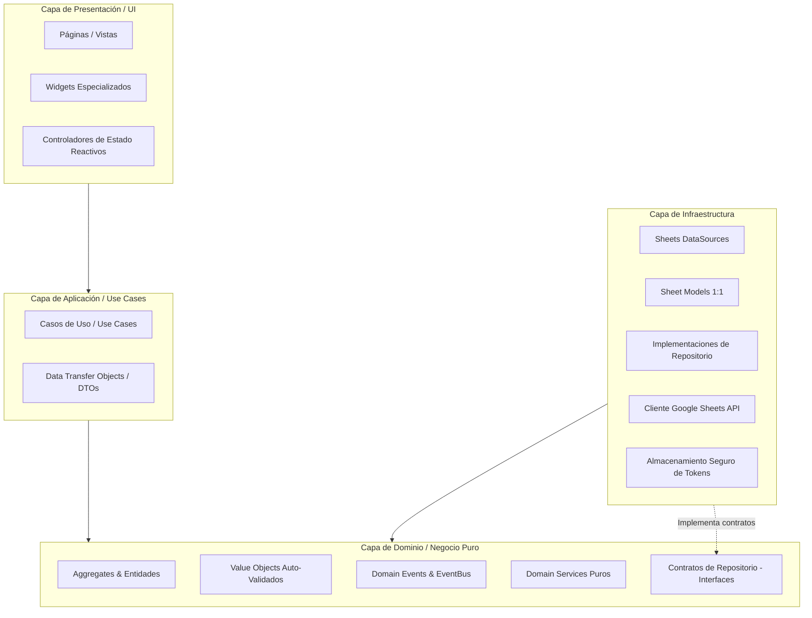

# Arquitectura Limpia (Clean Architecture) — Estilo Neutral

Este documento define la estructura de capas concéntricas implementada en el sistema según los principios de Robert C. Martin ("Uncle Bob") adaptada al ecosistema Flutter + Google Sheets.

---

## 1. Diagrama de Capas y Flujo de Dependencia

### Regla de Oro de Dependencias:
> **Las dependencias solo apuntan hacia adentro.**  
> La capa de **Dominio (`domain/`)** es el centro del sistema y **NO depende de NADA externo**: no conoce Flutter, ni la API de Google Sheets, ni librerías de terceros. Es Dart puro y 100% testeable en milisegundos.

---

## 2. Descripción de Capas

### 2.1 Dominio (`domain/`)
- Contiene los modelos del negocio: Aggregates (`Customer`, `Product`, `Sale`, `CurrencyPurchase`), entidades (`SaleItem`), Value Objects (`MoneyUsd`, `ExchangeRate`, etc.) e interfaces de repositorios.
- Protege los invariantes y reglas de negocio.

### 2.2 Aplicación (`application/`)
- Orquesta el flujo de ejecución mediante Casos de Uso (`CreateSaleUseCase`, `RegisterPaymentUseCase`, `RefreshDataUseCase`).
- Convierte entidades de dominio en DTOs listos para el consumo de la interfaz de usuario.
- No contiene reglas de negocio (éstas residen en los Aggregates o Domain Services).

### 2.3 Infraestructura (`infrastructure/`)
- Implementa los contratos de repositorio definidos en el dominio.
- Gestiona la comunicación con Google Sheets API (`spreadsheets.values.get`, `append`, `batchGet`).
- Realiza el mapeo bidireccional entre las filas de la hoja de cálculo (`models/`) y las entidades de dominio (`entities/`).
- Gestiona la persistencia segura de credenciales con `flutter_secure_storage`.

### 2.4 Presentación (`presentation/`)
- Interfaces de usuario en Flutter (Mobile, Desktop, Web).
- Controladores de estado reactivos que consumen exclusivamente Casos de Uso.
- Dispone del botón manual **"Actualizar"** que permite al usuario recargar la información bajo demanda (cero polling).
