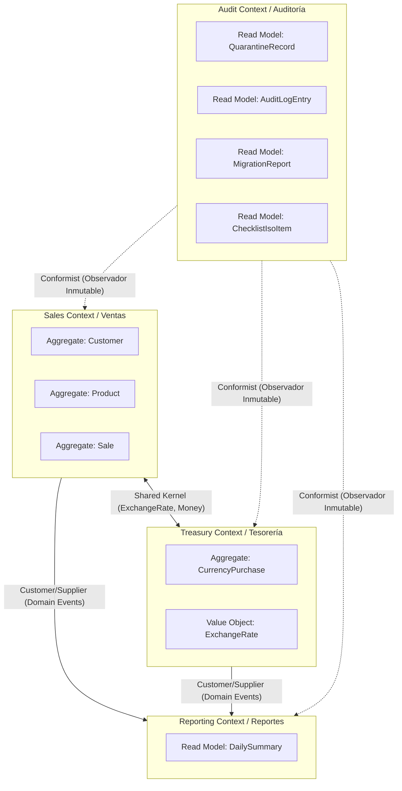

# Mapa de Contextos (Context Map) — Estilo Neutral

Este documento define formalmente los 4 **Bounded Contexts** (Contextos Delimitados) del sistema, sus límites de responsabilidad y los patrones de integración entre ellos según Domain-Driven Design (Eric Evans & Vaughn Vernon).

---

## 1. Diagrama de Relaciones de Contexto

---

## 2. Descripción de los Bounded Contexts

### 2.1 Contexto 1: Ventas (Sales Context)
- **Responsabilidad Principal**: Gestión del ciclo de vida del cliente, control de existencias en inventario, registro de transacciones de venta, liquidación de abonos y control de deudas pendientes.
- **Aggregates**:
  - `Customer` (Entidad Raíz: `clientes`)
  - `Product` (Entidad Raíz: `inventario`)
  - `Sale` (Entidad Raíz: `ventas`, con entidad interna `SaleItem`)
- **Hojas Asociadas**: `clientes`, `inventario`, `ventas`.

### 2.2 Contexto 2: Tesorería (Treasury Context)
- **Responsabilidad Principal**: Compra de divisas (USD/USDT) en plataformas externas (Binance P2P, bancos), conciliación de comisiones y registro de tasas cambiarias de referencia.
- **Aggregates**:
  - `CurrencyPurchase` (Entidad Raíz: `compras_divisas`)
- **Hojas Asociadas**: `compras_divisas`.

### 2.3 Contexto 3: Reportes (Reporting Context)
- **Responsabilidad Principal**: Agregación analítica de datos operacionales en tiempo real sin mutar registros transaccionales.
- **Modelos (Read-Only)**:
  - `DailySummary` (`resumen_diario`)
- **Hojas Asociadas**: `resumen_diario` (hoja protegida).

### 2.4 Contexto 4: Auditoría (Audit Context)
- **Responsabilidad Principal**: Trazabilidad forense continua, no-repudio, preservación de datos en cuarentena e inspección de cumplimiento de estándares internacionales.
- **Modelos (Read-Only)**:
  - `QuarantineRecord` (`cuarentena`)
  - `AuditLogEntry` (`audit_log`)
  - `MigrationReport` (`reporte_migracion`)
  - `ChecklistIsoItem` (`checklist_iso`)
- **Hojas Asociadas**: `cuarentena`, `audit_log`, `reporte_migracion`, `checklist_iso` (hojas protegidas).

---

## 3. Patrones de Integración y Reglas de Comunicación

1. **Shared Kernel (Núcleo Compartido)** entre `Sales` y `Treasury`:
   - Comparten los Value Objects monetarios inmutables: `MoneyUsd`, `MoneyBs`, `ExchangeRate`, `IsoDate`.
2. **Customer/Supplier**:
   - `Reporting Context` es el cliente (Customer) que consume los eventos emitidos por `Sales` (`SaleCreated`, `SalePaid`) y `Treasury` (`CurrencyPurchaseCreated`) para alimentar las métricas consolidadas.
3. **Conformist / Observador Inmutable**:
   - `Audit Context` registra las operaciones de todos los contextos mediante la bitácora criptográfica sin alterar la lógica de negocio de los demás.
4. **Regla de Oro de Aislamiento**:
   - Ningún contexto importa directamente clases de dominio de otro contexto. Toda interacción se realiza mediante **Value Objects compartidos**, **DTOs** o **Domain Events**.
