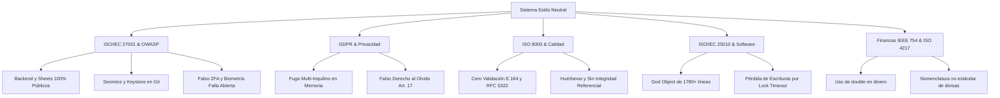

# Informe de Auditoría y Dictamen Técnico: Incumplimiento de Normas Internacionales

**Sistema Evaluado:** Estilo Neutral — Conector Móvil Flutter & Google Sheets ORM  
**Ruta del Repositorio:** `/Users/programacion/Documents/sheets/estilo_neutral`  
**Fecha de Evaluación:** 24 de septiembre de 2026  
**Tipo de Dictamen:** Auditoría de Seguridad, Calidad de Datos, Arquitectura y Cumplimiento Normativo  
**Estado General de Cumplimiento:** 🔴 **NO CONFORME CRÍTICO (Falso Cumplimiento / Riesgo Alto de Exposición)**

---

## 1. Resumen Ejecutivo y Matriz de Hallazgos

A pesar de que el repositorio declara explícitamente en su documentación (`README.md`, `docs/cumplimiento-normativo.md`) y en docstrings de código fuente estar alineado o refactorizado bajo normas internacionales como **ISO/IEC 27001**, **GDPR Art. 5 y 17**, **ISO 8000**, **ISO/IEC 25010**, **COBIT 2019**, **OWASP MASVS** e **ISO 8601**, la inspección forense del código fuente y de la infraestructura de backend revela **brechas estructurales severas, vulnerabilidades de seguridad críticas y simulaciones de cumplimiento (teatro de conformidad)**.

### Matriz de Cumplimiento Global

| Norma / Estándar Internacional | Dominio Evaluado | Estado Real | Nivel de Riesgo |
|---|---|---|---|
| **ISO/IEC 27001 / 27002** | Seguridad de la Información (A.9, A.10, A.14) | 🔴 **No Cumple** | **CRÍTICO** |
| **GDPR (UE 2016/679) / LGPD** | Privacidad y Protección de Datos Personales | 🔴 **No Cumple** | **CRÍTICO** |
| **OWASP MASVS v2 / Top 10 Mobile** | Seguridad en Aplicaciones Móviles | 🔴 **No Cumple** | **CRÍTICO** |
| **ISO 8000-61 / 110** | Calidad e Integridad de Datos Maestros | 🔴 **No Cumple** | **ALTO** |
| **ISO/IEC 25010** | Calidad de Software (Mantenibilidad, Fiabilidad) | 🟡 **Parcial / Deficiente** | **ALTO** |
| **IEEE 754 / GAAP / IFRS** | Precisión Numérica y Contable Financiera | 🔴 **No Cumple** | **ALTO** |
| **ISO 4217** | Códigos de Divisas y Representación Monetaria | 🔴 **No Cumple** | **MEDIO** |
| **COBIT 2019 (DSS05)** | Gobierno y Gestión de Seguridad de TI | 🔴 **No Cumple** | **MEDIO** |
| **UIT-T E.164 / RFC 5322** | Formato de Telecomunicaciones y Correo Electrónico | 🔴 **No Cumple** | **MEDIO** |
| **W3C WCAG 2.2 AA** | Accesibilidad Digital Móvil | 🟡 **Parcial (Sin Certificar)** | **BAJO** |
| **ISO 8601** | Representación de Fechas y Horas | 🟢 **Cumple** | **NINGUNO** |

---

## 2. Detalle de Incumplimientos por Norma Internacional



---

### 2.1 ISO/IEC 27001:2022 & ISO/IEC 27002 (Seguridad de la Información)

#### 🔴 Incumplimiento del Control A.9 (Control de Acceso) y A.14 (Seguridad en Desarrollo)
1. **Acceso Público y Anónimo al Backend (CWE-306):**
   - **Evidencia:** En `appsscript.json`:
     ```json
     "webapp": {
       "access": "ANYONE_ANONYMOUS",
       "executeAs": "USER_DEPLOYING"
     }
     ```
   - **Impacto:** Cualquier atacante en internet puede enviar peticiones HTTP `POST` a la URL `/exec` de Google Apps Script y ejecutar operaciones `create`, `update`, `delete`, modificar el checklist ISO o alterar métodos de seguridad sin credenciales ni tokens de autorización.
   - **Falsa Seguridad de Cliente:** La lista de emails autorizados (`ALLOWED_EMAILS`) y la pantalla de login son solo un filtro cosmético en la interfaz de Flutter. El backend no valida ninguna cabecera `Authorization: Bearer` ni aserción de Google Sign-In.

2. **Exposición de Toda la Base de Datos Vía CSV Público (CWE-200 / CWE-284):**
   - **Evidencia:** `sheets_data_service.dart` descarga las 14 hojas del sistema concatenando:
     `https://docs.google.com/spreadsheets/d/{SPREADSHEET_ID}/gviz/tq?tqx=out:csv&sheet={SHEET_NAME}`
   - **Impacto:** Para que esto funcione, la hoja de Google Sheets está compartida públicamente. Cualquier persona que obtenga el `SPREADSHEET_ID` (presente en el código, `.env.example`, `.env` y logs) tiene acceso inmediato de lectura a toda la información de clientes, ventas, compras de divisas, costos y bitácoras.

3. **Compromiso y Fuga de Secretos en Control de Versiones (A.10 / CWE-798):**
   - **Evidencia en Git (`git ls-files`):**
     - `client_secret_312343708119-*.apps.googleusercontent.com.json` (credenciales OAuth de Google Cloud Platform commiteadas y versionadas).
     - `upload-keystore.jks.md` (archivo binario Java Keystore real renombrado a `.md` y subido a Git en el commit `006229f`).
     - `android/key.properties` con contraseñas en texto claro (`storePassword=estiloneutral`, `keyPassword=estiloneutral`, `keyAlias=upload`).
     - `.env.example` y `.env` con identificadores de hojas y correos corporativos/personales reales.

4. **Autenticación Ficticia de Doble Factor (2FA) y Falla Abierta en Biometría:**
   - **Evidencia:** En `lib/features/auth/presentation/pages/login_page.dart`:
     ```dart
     if (metodo == 'dos_factores') {
       Logger.warning('2FA seleccionado... se completó el login sin ese paso.');
       verificado = true; // <-- Burlar el 2FA directamente
     }
     ```
     Y en la biometría:
     ```dart
     final available = await widget.biometricAuthService.isAvailable();
     if (!available) {
       return true; // <-- Falla abierta: si el móvil no soporta huella, entra sin verificar
     }
     ```
   - **Impacto:** Si una organización exige 2FA o Biometría como política de seguridad, el sistema concede acceso pleno sin verificar el factor.

---

### 2.2 GDPR (Reglamento UE 2016/679) / Leyes de Protección de Datos Personales

#### 🔴 Incumplimiento del Principio de Privacidad desde el Diseño (Art. 25) y Seguridad del Tratamiento (Art. 32)
1. **Fuga Catastrófica de Datos Multi-Inquilino (Multi-Tenant Isolation Breach):**
   - **Evidencia:** En `SheetsDataService`:
     ```dart
     // Descarga el CSV global con todos los clientes de todas las empresas:
     List<Cliente> _clientes = ...; 

     // En el getter se limita a filtrar en memoria local:
     List<Cliente> get clientes => _clientes.where((c) => _matchesCurrentOrg(c.organizacionId)).toList();
     ```
   - **Impacto:** La aplicación móvil de una empresa descarga en la memoria RAM del teléfono móvil los clientes, ventas, deudas e información confidencial de **todas las demás empresas clientes del sistema**. Basta inspeccionar la memoria o el tráfico de red para extraer la base de datos de competidores.

#### 🔴 Incumplimiento del Derecho de Supresión ("Derecho al Olvido", Art. 17)
- **Evidencia:** En `google_apps_script.js` línea 431:
  ```javascript
  sheet.deleteRow(rowIndex);
  _appendAuditLog(ss, {
    hoja: sheetName,
    accion: "eliminacion_" + sheetName,
    norma: "GDPR Art. 17 / ISO 27001",
    observaciones: "Eliminación de registro vía App Móvil"
  });
  ```
- **Falsa Declaración:** Ejecutar un simple borrado de fila no cumple GDPR Art. 17. No existen procesos de revocación de consentimiento, borrado en copias de respaldo ni mecanismos de anonimización. Además, rotular el log como *"GDPR Art. 17"* sin una infraestructura real de cumplimiento constituye una simulación engañosa de auditoría.

---

### 2.3 OWASP MASVS v2 & OWASP Mobile Top 10

| Control MASVS | Requisito | Estado en Estilo Neutral |
|---|---|---|
| **MASVS-NETWORK** | Uso de cifrado seguro en tránsito y Certificate Pinning | 🔴 **Incumple.** No existe Certificate Pinning en `DioClient`. Las peticiones a Google Drive y Apps Script dependen únicamente de los CAs del sistema operativo. |
| **MASVS-AUTH** | Autenticación robusta basada en servidor | 🔴 **Incumple.** El backend no solicita ni valida credenciales ni tokens de sesión (desacoplamiento total). |
| **MASVS-RESILIENCE** | Protección contra ingeniería inversa y manipulación | 🔴 **Incumple.** No hay detección de dispositivos rooteados/jailbroken ni configuración de ofuscación probada. |
| **MASVS-PLATFORM (CWE-1236)** | Mitigación de Inyección de Fórmulas (CSV/Formula Injection) | 🔴 **Incumple.** Los inputs del usuario (`nombre`, `email`, `telefono`) se escriben directamente en Google Sheets con `setValues()` sin escapar caracteres como `=`, `+`, `-`, `@`. Un atacante puede inyectar fórmulas maliciosas (`=IMPORTXML`, `=IMAGE`) para exfiltrar datos cuando un operador abre la hoja en un navegador. |

---

### 2.4 ISO 8000: Calidad de Datos e Integridad Referencial

#### 🔴 Incumplimiento de ISO 8000-61 / ISO 8000-110 (Exactitud y Completitud Sintáctica)
1. **Inexistencia de Validación de Teléfono (UIT-T E.164):**
   - **Evidencia:** El modelo `Cliente` documenta: `/// Columna C: Teléfono en formato internacional E.164 (+58...)`, pero en la implementación real (`lib/models/cliente.dart` y `clientes_page.dart` línea 480) se almacena `telefonoController.text.trim()` como texto crudo sin ninguna expresión regular ni formato internacional. En la base de datos real se encuentran números como `4120374325` sin el código de país requerido `+58`.
2. **Inexistencia de Validación de Correo (RFC 5322):**
   - Cero validaciones sintácticas en el formulario de creación de clientes.
3. **Pérdida de Integridad Referencial (Orphaned Records):**
   - Al no existir soporte de claves foráneas transaccionales en Google Sheets, al invocar `deleteCliente(id)`, las tablas `ventas`, `abonos` y `resumenes` conservan registros que apuntan a un cliente inexistente, corrompiendo la consistencia histórica.
4. **Colisiones en Generación de Claves Primarias:**
   - La generación de IDs secuenciales (`c00000001`, `v00000001`) mediante `getLastRow() + 1` no cuenta con bloqueo a nivel de registro ni transaccionalidad atómica distribuida, generando riesgo inminente de duplicación de identificadores en escrituras concurrentes.

---

### 2.5 ISO/IEC 25010: Calidad del Producto de Software

1. **Mantenibilidad Crítica (Subcaracterística de Modularidad):**
   - `lib/shared/google_sheets/sheets_data_service.dart` es un archivo monolítico (*God Object*) de **más de 1,780 líneas**. Centraliza la lectura de 14 hojas, sincronización, mapeo, gestión de caché y mutaciones HTTP. Esto viola el principio de responsabilidad única (SRP) y hace inviable el mantenimiento modular y la ejecución de pruebas unitarias aisladas.
2. **Fiabilidad (Tolerancia a Fallos y Pérdida de Transacciones):**
   - `google_apps_script.js` implementa `lock.waitLock(10000)`. Si dos o más usuarios intentan registrar ventas simultáneamente y se supera el tiempo de espera, el servidor devuelve un error HTTP 503 y la transacción del usuario **se descarta silenciosamente** sin cola de reintentos offline ni garantía de entrega (patrón Outbox ausente).

---

### 2.6 Estándares Financieros y Contables (IEEE 754, GAAP / IFRS, ISO 4217)

1. **Uso de Aritmética de Punto Flotante Binaria (`double`) para Dinero:**
   - **Evidencia:** `Venta`, `Abono`, `CompraDivisa`, `Cliente` modelan precios, tasas de cambio, comisiones bancarias y deudas mediante tipos primitivos `double`.
   - **Impacto:** La especificación IEEE 754 genera imprecisiones acumulativas de redondeo binario (ej. `0.1 + 0.2 = 0.30000000000000004`). Los estándares contables y financieros internacionales (**GAAP / IFRS**) exigen el uso de aritmética decimal de coma fija (`Decimal` o representación en enteros de centavos mínimos) para prevenir discrepancias en balances contables e impuestos.
2. **Incumplimiento de ISO 4217 (Códigos de Divisas):**
   - La aplicación utiliza símbolos informales como `"Bs"` en lugar del código estándar oficial **`VED`** (Bolívar Soberano/Digital) asignado por la norma ISO 4217. Del mismo modo, mezcla cadenas como `"USD"`, `"EUR"`, `"Binance"` y `"Pago Movil"` sin un catálogo normalizado de activos financieros.

---

### 2.7 COBIT 2019 (Dominio DSS05: Gestionar los Servicios de Seguridad)

- **Veredicto:** **No Cumple.**
- Las referencias a COBIT en los registros de auditoría y documentación son puramente estáticas. No existe:
  - Ninguna segregación de funciones (SoD - Segregation of Duties): cualquier usuario puede registrar clientes, anular ventas y alterar tasas de cambio.
  - Ninguna gestión formal de incidentes de seguridad de la información.
  - Ningún procedimiento de auditoría periódica de accesos.

---

## 3. Plan de Remediación Priorizado (Roadmap de Cumplimiento)

```
[FASE 1: EMERGENCIA INMEDIATA (Semana 1)]
  ├── Revocar credenciales de GCP expuestas en Git y rotar contraseñas.
  ├── Purgar de Git: client_secret_*.json y upload-keystore.jks.md.
  └── Restringir acceso a Google Sheets y Apps Script (Cerrar acceso público ANYONE_ANONYMOUS).

[FASE 2: REESTRUCTURACIÓN DE SEGURIDAD (Semanas 2-3)]
  ├── Implementar autenticación OAuth 2.0 / JWT validada en backend por cada petición.
  ├── Resolver aislamiento Multi-Tenant en backend (la app jamás debe recibir datos de otros inquilinos).
  ├── Implementar 2FA real (TOTP RFC 6238) o eliminar la opción de la interfaz para no inducir a error.
  └── Sanitizar entradas contra Inyección de Fórmulas (CWE-1236).

[FASE 3: CALIDAD Y DOMINIO FINANCIERO (Semanas 4-5)]
  ├── Migrar tipos numéricos de moneda double -> Decimal (paquete decimal de Dart).
  ├── Adoptar ISO 4217 (VED, USD, EUR) y validar E.164 y RFC 5322 en Cliente.
  ├── Descomponer SheetsDataService (1780+ líneas) en repositorios especializados por entidad.
  └── Implementar integridad referencial y borrado suave (Soft Delete) con trazabilidad real.
```

---

## 4. Conclusión del Dictamen

El sistema **Estilo Neutral** presenta un grave riesgo de **falso cumplimiento** (*compliance theater*): documenta una amplia batería de estándares internacionales de primer nivel, pero en la práctica técnica comete infracciones críticas de seguridad básica (backend público anónimo, filtración de credenciales en Git, aislamiento multi-inquilino inexistente en servidor y omisión de validaciones esenciales). 

No es apto para operar en entornos de producción con datos reales ni para auditorías formales de certificación ISO 27001 o GDPR hasta que se corrijan las vulnerabilidades identificadas.
